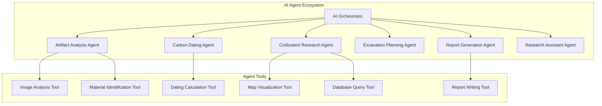
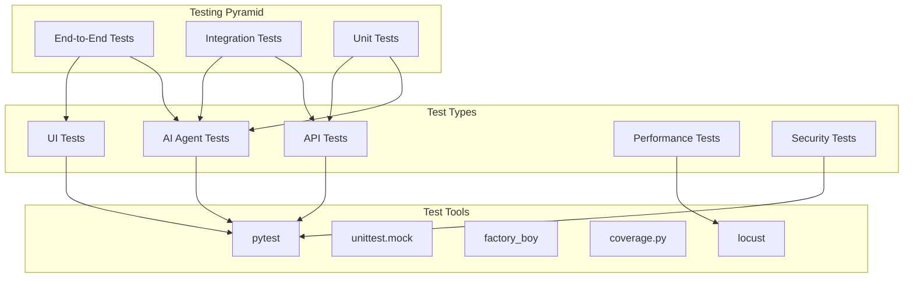

# 🏺 ArchaeoVault - The Digital Archaeologist

[](https://streamlit.io/)
[](https://python.org/)
[](https://anthropic.com/)
[](https://en.wikipedia.org/wiki/Artificial_intelligence_agent)
[](https://12factor.net/)

> **An agentic AI-powered archaeological research platform featuring multiple specialized AI agents that collaborate to analyze artifacts, research civilizations, reconstruct timelines, and generate excavation reports. Built with 12-Factor App principles and microservices architecture.**

---

## 🤖 Agentic AI Architecture

ArchaeoVault features a sophisticated **multi-agent AI system** where specialized AI agents collaborate to provide comprehensive archaeological analysis:



### 🧠 **Specialized AI Agents**

#### 🏺 **Artifact Analysis Agent**
- **Purpose**: Comprehensive artifact analysis and identification
- **Tools**: Image analysis, material identification, cultural context analysis
- **Capabilities**: Visual description, civilization origin, historical significance, preservation recommendations
- **AI Model**: Claude Sonnet 4.5 with specialized archaeological training

#### ⏳ **Carbon Dating Agent**
- **Purpose**: Scientific dating calculations and analysis
- **Tools**: C-14 calculation engine, calibration tools, error analysis
- **Capabilities**: Raw age calculation, calibrated dating, confidence intervals, method comparison
- **AI Model**: Claude Sonnet 4.5 with scientific calculation capabilities

#### 🌍 **Civilization Research Agent**
- **Purpose**: Deep research into ancient civilizations and cultures
- **Tools**: Database query engine, map visualization, timeline builder
- **Capabilities**: Cultural analysis, geographic research, achievement mapping, relationship analysis
- **AI Model**: Claude Sonnet 4.5 with historical knowledge base

#### ⛏️ **Excavation Planning Agent**
- **Purpose**: Intelligent excavation site planning and strategy
- **Tools**: Grid planning tools, resource calculator, risk assessment
- **Capabilities**: Site analysis, excavation strategy, resource estimation, timeline planning
- **AI Model**: Claude Sonnet 4.5 with archaeological methodology expertise

#### 📝 **Report Generation Agent**
- **Purpose**: Professional archaeological report creation
- **Tools**: Writing assistant, citation manager, template engine
- **Capabilities**: Report structuring, academic writing, citation management, format conversion
- **AI Model**: Claude Sonnet 4.5 with academic writing expertise

#### 💬 **Research Assistant Agent**
- **Purpose**: General archaeological research and knowledge assistance
- **Tools**: Literature search, hypothesis generator, statistical analyzer
- **Capabilities**: Research guidance, hypothesis development, data analysis, literature review
- **AI Model**: Claude Sonnet 4.5 with comprehensive archaeological knowledge

## 🌟 **Core Features**

### 🏺 **Artifact Analysis & Dating**
- **Agent-Powered**: Multi-agent collaboration for comprehensive analysis
- **Visual Analysis**: AI-powered image recognition and description
- **Material Identification**: Advanced material classification and dating
- **Historical Context**: Deep cultural and historical significance analysis
- **Preservation Guidelines**: AI-generated conservation recommendations

### ⏳ **Carbon Dating Calculator**
- **Scientific Precision**: Advanced C-14 dating calculations
- **Interactive Visualization**: Real-time decay curve analysis
- **Calibrated Dating**: Multiple calibration methods and error analysis
- **Method Comparison**: Side-by-side comparison with other dating techniques
- **Confidence Intervals**: Statistical analysis of dating accuracy

### 🌍 **Civilization Database Explorer**
- **Intelligent Search**: AI-powered civilization discovery and research
- **Interactive Maps**: Dynamic geographic visualization of ancient cultures
- **Cultural Analysis**: Deep dive into achievements, artifacts, and relationships
- **Timeline Integration**: Chronological analysis of cultural development
- **Research Chat**: Conversational AI for civilization research

### ⛏️ **Excavation Planner**
- **AI Strategy Generation**: Intelligent excavation planning and optimization
- **Grid-Based Planning**: Professional archaeological grid system
- **Resource Management**: Automated resource and timeline estimation
- **Risk Assessment**: AI-powered risk analysis and mitigation strategies
- **Professional Reports**: Automated excavation documentation

### 📊 **Stratigraphy Layer Analyzer**
- **Visual Layer Builder**: Interactive soil profile creation
- **AI Interpretation**: Intelligent stratigraphic sequence analysis
- **3D Visualization**: Advanced 3D layer modeling and analysis
- **Timeline Reconstruction**: Automated chronological sequence building
- **Context Analysis**: Cultural and environmental context interpretation

### 📅 **Timeline Reconstruction Tool**
- **Interactive Builder**: Dynamic timeline creation and editing
- **AI Suggestions**: Intelligent event relationship discovery
- **Confidence Assessment**: Statistical confidence analysis
- **Visual Export**: Professional timeline infographics
- **Collaborative Features**: Multi-user timeline development

### 📝 **Archaeological Report Generator**
- **AI Writing Assistant**: Intelligent report composition and structuring
- **Template System**: Professional archaeological report templates
- **Citation Management**: Automated reference and citation handling
- **Format Conversion**: Multiple export formats (PDF, DOCX, HTML)
- **Quality Assurance**: AI-powered content review and improvement

### 🔮 **3D Artifact Visualization**
- **Interactive Viewer**: Advanced 3D artifact examination
- **Measurement Tools**: Precise dimensional analysis
- **Annotation System**: Collaborative artifact documentation
- **Virtual Restoration**: AI-powered artifact reconstruction preview
- **Comparison Tools**: Side-by-side artifact analysis

### 💬 **Research Assistant**
- **Conversational AI**: Natural language archaeological research
- **Literature Review**: Automated research paper analysis and summarization
- **Hypothesis Generation**: AI-powered research question development
- **Statistical Analysis**: Advanced data analysis and visualization
- **Knowledge Integration**: Cross-disciplinary research insights

---

## 🚀 Quick Start

### Prerequisites

- Python 3.8 or higher
- Anthropic API key (for Claude AI integration)
- Git

### Installation & Running

#### Option 1: Quick Start (Recommended)

1. **Clone the repository**
   ```bash
   git clone https://github.com/vishalm/ArchaeoVault.git
   cd ArchaeoVault
   ```

2. **Run the application (automated setup)**
   ```bash
   # Make the run script executable and run
   chmod +x run.sh
   ./run.sh
   ```

   This will automatically:
   - Create a virtual environment
   - Install all dependencies
   - Start the application

#### Option 2: Manual Setup

1. **Clone the repository**
   ```bash
   git clone https://github.com/vishalm/ArchaeoVault.git
   cd ArchaeoVault
   ```

2. **Create virtual environment**
   ```bash
   python3 -m venv venv
   source venv/bin/activate  # On Windows: venv\Scripts\activate
   ```

3. **Install dependencies**
   ```bash
   pip install -r requirements.txt
   ```

4. **Set up environment variables**
   ```bash
   cp env.template .env
   # Edit .env and add your ANTHROPIC_API_KEY
   ```

5. **Run the application**
   ```bash
   python run.py
   ```

#### Option 3: Using pip with pyproject.toml

1. **Clone and install**
   ```bash
   git clone https://github.com/vishalm/ArchaeoVault.git
   cd ArchaeoVault
   pip install -e .
   ```

2. **Run the application**
   ```bash
   python run.py
   ```

### Running the Application

Once installed, you can start ArchaeoVault using any of these methods:

```bash
# Method 1: Using the run script (recommended)
./run.sh

# Method 2: Using Python directly
python run.py

# Method 3: Using Streamlit directly
streamlit run streamlit_app.py

# Method 4: Using the module
python -m streamlit_app
```

The application will start and be available at `http://localhost:8501`

#### Option 2: Using pip

1. **Clone the repository**
   ```bash
   git clone https://github.com/vishalm/ArchaeoVault.git
   cd ArchaeoVault
   ```

2. **Create virtual environment**
   ```bash
   python -m venv venv
   source venv/bin/activate  # On Windows: venv\Scripts\activate
   ```

3. **Install dependencies**
   ```bash
   pip install -r requirements.txt
   ```

4. **Set up environment variables**
   ```bash
   cp .env.example .env
   # Edit .env and add your ANTHROPIC_API_KEY
   ```

5. **Run the application**
   ```bash
   streamlit run app.py
   ```

6. **Open your browser**
   Navigate to `http://localhost:8501`

---

## ⚙️ Configuration

### Environment Variables

Create a `.env` file in the project root with the following variables:

```env
# Required
ANTHROPIC_API_KEY=your_anthropic_api_key_here

# Optional
APP_NAME=ArchaeoVault
DEBUG_MODE=False
LOG_LEVEL=INFO
DATABASE_URL=sqlite:///archaeo.db
MAPBOX_TOKEN=your_mapbox_token_here

# Feature Flags
ENABLE_AI_ANALYSIS=True
ENABLE_3D_VIEWER=True

# Limits
MAX_UPLOAD_SIZE_MB=10
MAX_REPORT_LENGTH=5000
```

### Getting API Keys

1. **Anthropic API Key** (Required)
   - Visit [Anthropic Console](https://console.anthropic.com/)
   - Create an account and generate an API key
   - Add to your `.env` file

2. **Mapbox Token** (Optional)
   - Visit [Mapbox](https://www.mapbox.com/)
   - Create a free account and get your token
   - Enables enhanced mapping features

---

## 🏗️ Architecture

### 12-Factor App Compliance

ArchaeoVault follows the [12-Factor App methodology](https://12factor.net/) for building modern, scalable applications:

1. **Codebase** - Single codebase with clear structure
2. **Dependencies** - Explicit dependency declaration
3. **Config** - Environment-based configuration
4. **Backing Services** - Treat external services as attached resources
5. **Build, Release, Run** - Strict separation of build and run stages
6. **Processes** - Stateless, share-nothing processes
7. **Port Binding** - Self-contained web service
8. **Concurrency** - Scale via process model
9. **Disposability** - Fast startup and graceful shutdown
10. **Dev/Prod Parity** - Keep environments similar
11. **Logs** - Treat logs as event streams
12. **Admin Processes** - Run admin tasks as one-off processes

### Project Structure

```
ArchaeoVault/
├── app/
│   ├── pages/              # Streamlit page modules
│   │   ├── home.py
│   │   ├── artifact_analyzer.py
│   │   ├── carbon_dating.py
│   │   ├── civilizations.py
│   │   ├── excavation_planner.py
│   │   ├── stratigraphy.py
│   │   ├── timeline.py
│   │   ├── reports.py
│   │   ├── viewer_3d.py
│   │   └── research_chat.py
│   ├── components/         # Reusable UI components
│   │   ├── artifact_card.py
│   │   ├── civilization_badge.py
│   │   └── timeline_widget.py
│   ├── services/           # Business logic
│   │   ├── ai_analyzer.py
│   │   ├── external.py
│   │   └── storage.py
│   ├── models/             # Data models
│   │   ├── artifact.py
│   │   ├── civilization.py
│   │   └── excavation.py
│   ├── utils/              # Helper functions
│   │   ├── helpers.py
│   │   └── validators.py
│   └── app.py              # Main application entry point
├── tests/                  # Test suite
│   ├── test_ai_analyzer.py
│   ├── test_models.py
│   └── test_utils.py
├── docs/                   # Documentation
│   ├── ARCHITECTURE.md
│   ├── API.md
│   └── USER_GUIDE.md
├── pyproject.toml         # Python project configuration (uv/pip)
├── requirements.txt       # Python dependencies (legacy)
├── .env.example          # Environment variables template
├── .gitignore
├── Dockerfile
├── docker-compose.yml
└── README.md
```

---

## 🎨 UI/UX Design

### Color Palette
- **Primary**: Saddle Brown (#8B4513)
- **Secondary**: Chocolate (#D2691E)
- **Background**: Antique White (#F5E6D3)
- **Text**: Dark Brown (#3E2723)

### Design Principles
- Earth tones inspired by archaeological sites
- Ancient-inspired typography and textures
- Responsive design for all devices
- Smooth animations and transitions
- Intuitive navigation with clear visual hierarchy

---

## 🔧 Development

### Local Development

#### Using uv (Recommended)

1. **Install development dependencies**
   ```bash
   uv pip install -e ".[dev]"
   ```

2. **Run tests**
   ```bash
   uv run pytest tests/
   ```

3. **Run with hot reload**
   ```bash
   uv run streamlit run app.py --server.runOnSave true
   ```

4. **Code formatting**
   ```bash
   uv run black app/
   uv run isort app/
   ```

5. **Type checking**
   ```bash
   uv run mypy app/
   ```

#### Using pip (Legacy)

1. **Install development dependencies**
   ```bash
   pip install -r requirements-dev.txt
   ```

2. **Run tests**
   ```bash
   pytest tests/
   ```

3. **Run with hot reload**
   ```bash
   streamlit run app.py --server.runOnSave true
   ```

4. **Code formatting**
   ```bash
   black app/
   isort app/
   ```

### Docker Development

1. **Build and run with Docker Compose**
   ```bash
   docker-compose up --build
   ```

2. **Access the application**
   Navigate to `http://localhost:8501`

---

## 🚀 Deployment

### Streamlit Cloud (Recommended)

1. **Fork this repository**
2. **Connect to Streamlit Cloud**
   - Go to [share.streamlit.io](https://share.streamlit.io)
   - Connect your GitHub account
   - Select this repository
3. **Add secrets**
   - Add `ANTHROPIC_API_KEY` in the secrets section
   - Add other environment variables as needed
4. **Deploy**
   - Click "Deploy" and wait for deployment

### Docker Deployment

1. **Build the image**
   ```bash
   docker build -t archaeovault .
   ```

2. **Run the container**
   ```bash
   docker run -p 8501:8501 --env-file .env archaeovault
   ```

### Heroku Deployment

1. **Install Heroku CLI**
2. **Create Heroku app**
   ```bash
   heroku create your-archaeovault-app
   ```

3. **Set environment variables**
   ```bash
   heroku config:set ANTHROPIC_API_KEY=your_key_here
   ```

4. **Deploy**
   ```bash
   git push heroku main
   ```

### AWS/GCP/Azure

For production deployments on cloud platforms, refer to the [Deployment Guide](docs/DEPLOYMENT.md).

---

## 📊 Performance

### Caching Strategy
- **Data caching**: `@st.cache_data` for expensive computations
- **Session caching**: Store user data in `st.session_state`
- **External caching**: Redis for production deployments

### Optimization
- Lazy loading of heavy libraries
- Image optimization and compression
- Efficient data structures and algorithms
- Horizontal scaling via process model

---

## 🧪 Testing & Quality Assurance

### Comprehensive Testing Strategy

ArchaeoVault implements a **multi-layered testing approach** ensuring reliability and performance across all AI agents and system components:



### 🧠 **AI Agent Testing**

#### Unit Tests for Each Agent
```python
# Example: Artifact Analysis Agent Tests
class TestArtifactAnalysisAgent:
    @pytest.fixture
    def agent(self):
        return ArtifactAnalysisAgent(config=test_config)
    
    @pytest.mark.asyncio
    async def test_analyze_ceramic_artifact(self, agent):
        """Test ceramic artifact analysis"""
        artifact_data = ArtifactDataFactory.create(material="ceramic")
        result = await agent.analyze_artifact(artifact_data)
        
        assert result.material == "ceramic"
        assert result.confidence > 0.7
        assert "pottery" in result.description.lower()
    
    @pytest.mark.asyncio
    async def test_analyze_metal_artifact(self, agent):
        """Test metal artifact analysis"""
        artifact_data = ArtifactDataFactory.create(material="metal")
        result = await agent.analyze_artifact(artifact_data)
        
        assert result.material == "metal"
        assert result.dating_estimate is not None
        assert result.preservation_notes is not None
```

#### Agent Integration Tests
```python
class TestAgentOrchestration:
    @pytest.mark.asyncio
    async def test_multi_agent_workflow(self):
        """Test multi-agent collaboration"""
        orchestrator = AIOrchestrator()
        request = ComplexRequestFactory.create()
        
        result = await orchestrator.process_complex_request(request)
        
        assert result.artifact_analysis is not None
        assert result.civilization_context is not None
        assert result.dating_analysis is not None
        assert result.confidence_score > 0.5
```

### 🔧 **API Testing**

#### RESTful API Tests
```python
class TestArtifactAPI:
    @pytest.fixture
    def client(self):
        return TestClient(app)
    
    def test_create_artifact(self, client):
        """Test artifact creation endpoint"""
        artifact_data = {
            "name": "Test Pottery",
            "material": "ceramic",
            "period": "Bronze Age"
        }
        
        response = client.post("/api/v1/artifacts", json=artifact_data)
        assert response.status_code == 201
        assert response.json()["name"] == "Test Pottery"
    
    def test_analyze_artifact(self, client):
        """Test artifact analysis endpoint"""
        artifact_id = "test-artifact-123"
        response = client.post(f"/api/v1/artifacts/{artifact_id}/analyze")
        
        assert response.status_code == 200
        assert "analysis" in response.json()
```

### 🎨 **UI Testing**

#### Streamlit Component Tests
```python
class TestStreamlitComponents:
    def test_artifact_upload_component(self):
        """Test artifact upload component"""
        component = ArtifactUploadComponent()
        result = component.render()
        
        assert "Upload Artifact Image" in result
        assert component.accepted_file_types == ["png", "jpg", "jpeg"]
    
    def test_analysis_display_component(self):
        """Test analysis results display"""
        analysis_data = AnalysisDataFactory.create()
        component = AnalysisDisplayComponent(analysis_data)
        result = component.render()
        
        assert "Analysis Results" in result
        assert "Confidence Score" in result
```

### ⚡ **Performance Testing**

#### Load Testing with Locust
```python
# locustfile.py
from locust import HttpUser, task, between

class ArchaeoVaultUser(HttpUser):
    wait_time = between(1, 3)
    
    @task(3)
    def analyze_artifact(self):
        """Test artifact analysis under load"""
        self.client.post("/api/v1/artifacts/analyze", 
                        json={"artifact_id": "test-123"})
    
    @task(1)
    def search_civilizations(self):
        """Test civilization search under load"""
        self.client.get("/api/v1/civilizations?query=egypt")
```

### 🔒 **Security Testing**

#### Authentication & Authorization Tests
```python
class TestSecurity:
    def test_unauthorized_access(self, client):
        """Test unauthorized access is blocked"""
        response = client.get("/api/v1/artifacts")
        assert response.status_code == 401
    
    def test_authorized_access(self, client, auth_headers):
        """Test authorized access works"""
        response = client.get("/api/v1/artifacts", headers=auth_headers)
        assert response.status_code == 200
    
    def test_rate_limiting(self, client):
        """Test rate limiting works"""
        for _ in range(100):  # Exceed rate limit
            response = client.post("/api/v1/artifacts/analyze")
        
        assert response.status_code == 429
```

### 📊 **Test Coverage & Quality Metrics**

#### Coverage Requirements
- **Unit Tests**: 90%+ code coverage
- **Integration Tests**: 80%+ API endpoint coverage
- **AI Agent Tests**: 95%+ agent functionality coverage
- **UI Tests**: 70%+ critical user flow coverage

#### Quality Gates
```yaml
# .github/workflows/quality-gate.yml
quality_gates:
  coverage:
    minimum: 90%
  performance:
    response_time: < 2s
    throughput: > 100 req/s
  security:
    vulnerabilities: 0 high, 0 critical
  code_quality:
    complexity: < 10
    maintainability: A
```

### 🚀 **Running Tests**

#### Local Development
```bash
# Run all tests
pytest

# Run with coverage
pytest --cov=app --cov-report=html

# Run specific test categories
pytest -m "unit"                    # Unit tests only
pytest -m "integration"             # Integration tests only
pytest -m "ai_agents"               # AI agent tests only
pytest -m "performance"             # Performance tests only

# Run with verbose output
pytest -v

# Run specific test file
pytest tests/test_artifact_agent.py

# Run tests in parallel
pytest -n auto
```

#### CI/CD Pipeline
```bash
# GitHub Actions workflow
- name: Run Tests
  run: |
    pytest --cov=app --cov-report=xml
    coverage report --fail-under=90

- name: Run Performance Tests
  run: |
    locust --headless --users 100 --spawn-rate 10 --run-time 60s

- name: Security Scan
  run: |
    bandit -r app/
    safety check
```

#### Test Data Management
```python
# tests/factories.py
class ArtifactDataFactory:
    @staticmethod
    def create(**kwargs):
        return ArtifactData(
            name=kwargs.get('name', 'Test Artifact'),
            material=kwargs.get('material', 'ceramic'),
            period=kwargs.get('period', 'Bronze Age'),
            condition_score=kwargs.get('condition_score', 8),
            **kwargs
        )

class CivilizationDataFactory:
    @staticmethod
    def create(**kwargs):
        return CivilizationData(
            name=kwargs.get('name', 'Test Civilization'),
            time_period=kwargs.get('time_period', (3000, 1000)),
            region=kwargs.get('region', 'Test Region'),
            **kwargs
        )
```

### 📈 **Test Monitoring & Reporting**

#### Test Results Dashboard
- **Real-time Test Status**: Live test execution monitoring
- **Coverage Reports**: Visual coverage analysis
- **Performance Metrics**: Response time and throughput tracking
- **Failure Analysis**: Detailed failure investigation and debugging
- **Trend Analysis**: Test performance over time

#### Automated Reporting
```python
# tests/reporting.py
class TestReporter:
    def generate_coverage_report(self):
        """Generate detailed coverage report"""
        pass
    
    def generate_performance_report(self):
        """Generate performance test report"""
        pass
    
    def generate_security_report(self):
        """Generate security test report"""
        pass
```

### 🎯 **Testing Best Practices**

1. **Test-Driven Development (TDD)**: Write tests before implementation
2. **Behavior-Driven Development (BDD)**: Use Gherkin for user stories
3. **Mock External Dependencies**: Isolate units under test
4. **Use Test Factories**: Generate consistent test data
5. **Parametrized Tests**: Test multiple scenarios efficiently
6. **Test Isolation**: Each test should be independent
7. **Meaningful Assertions**: Clear and specific test assertions
8. **Test Documentation**: Document complex test scenarios
9. **Regular Test Maintenance**: Keep tests up to date
10. **Performance Baseline**: Establish performance benchmarks

---

## 📚 Documentation

- **[Architecture Guide](docs/ARCHITECTURE.md)** - System design and patterns
- **[API Documentation](docs/API.md)** - Internal API reference
- **[User Guide](docs/USER_GUIDE.md)** - Feature walkthrough
- **[Contributing Guide](CONTRIBUTING.md)** - How to contribute
- **[Deployment Guide](docs/DEPLOYMENT.md)** - Production deployment

---

## 🤝 Contributing

We welcome contributions! Please see our [Contributing Guide](CONTRIBUTING.md) for details.

### Development Setup
1. Fork the repository
2. Create a feature branch
3. Make your changes
4. Add tests for new functionality
5. Submit a pull request

### Code Style
- Follow PEP 8 guidelines
- Use type hints where appropriate
- Write comprehensive docstrings
- Include unit tests for new features

---

## 🐛 Troubleshooting

### Common Issues

**Q: The app won't start**
- Check that all dependencies are installed: `pip install -r requirements.txt`
- Verify your `.env` file has the required variables
- Ensure Python 3.8+ is being used

**Q: AI analysis not working**
- Verify your `ANTHROPIC_API_KEY` is correct
- Check your internet connection
- Ensure you have sufficient API credits

**Q: Images not uploading**
- Check file size (max 10MB by default)
- Verify file format (PNG, JPG supported)
- Ensure sufficient disk space

**Q: Performance issues**
- Clear browser cache
- Restart the application
- Check system resources

### Getting Help

- Check the [Issues](https://github.com/vishalm/ArchaeoVault/issues) page
- Create a new issue with detailed information
- Join our community discussions

---

## 📄 License

This project is licensed under the MIT License - see the [LICENSE](LICENSE) file for details.

---

## 🙏 Acknowledgments

- **Anthropic** for providing Claude AI capabilities
- **Streamlit** for the amazing web framework
- **Archaeological community** for inspiration and feedback
- **Open source contributors** who made this possible

---

## 📞 Support

- **Documentation**: [docs/](docs/)
- **Issues**: [GitHub Issues](https://github.com/vishalm/ArchaeoVault/issues)
- **Discussions**: [GitHub Discussions](https://github.com/vishalm/ArchaeoVault/discussions)
- **Email**: support@archaeovault.com

---

## 🔮 Roadmap

### Version 2.0
- [ ] Mobile app (React Native)
- [ ] Advanced 3D modeling
- [ ] Collaborative excavation planning
- [ ] Machine learning artifact classification
- [ ] Integration with museum databases

### Version 2.1
- [ ] Multi-language support
- [ ] Advanced statistical analysis
- [ ] VR/AR visualization
- [ ] Blockchain artifact provenance
- [ ] Advanced AI research assistant

---

<div align="center">

**Built with ❤️ for the archaeological community**

[](https://github.com/vishalm/ArchaeoVault)
[](https://github.com/vishalm/ArchaeoVault/fork)
[](https://github.com/vishalm/ArchaeoVault)

</div>
