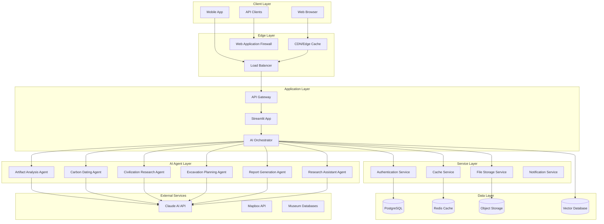
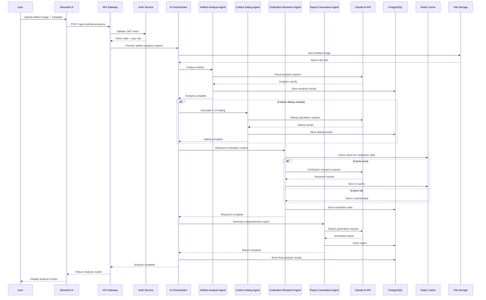
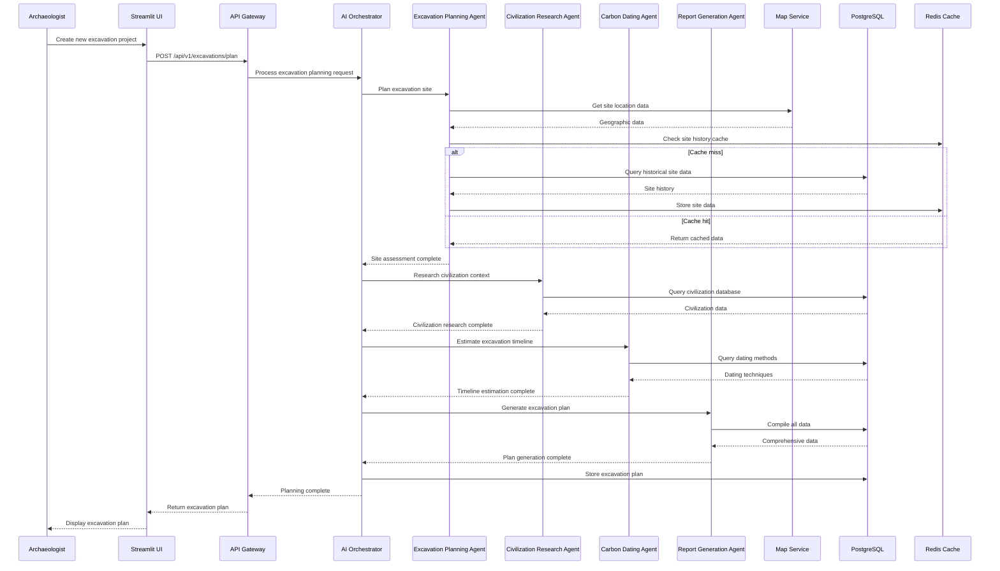
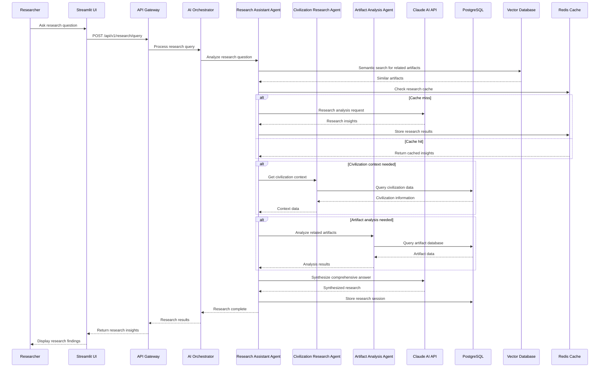
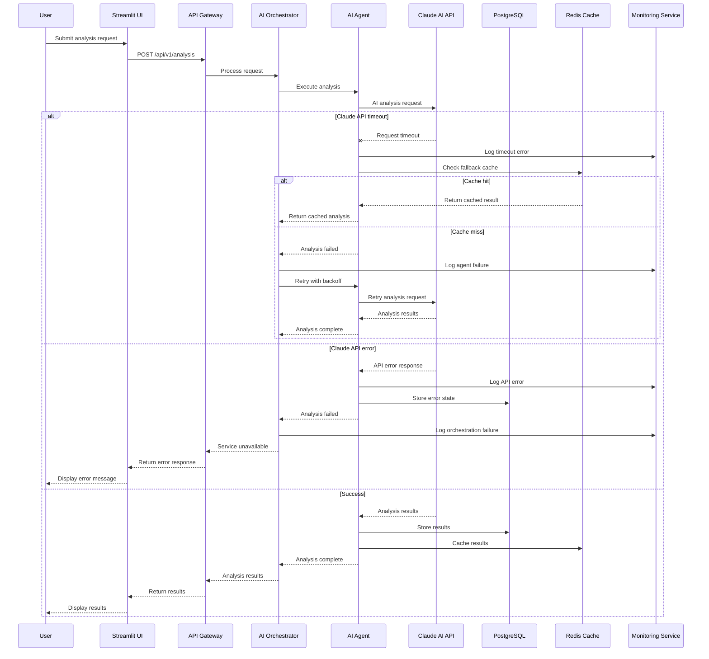
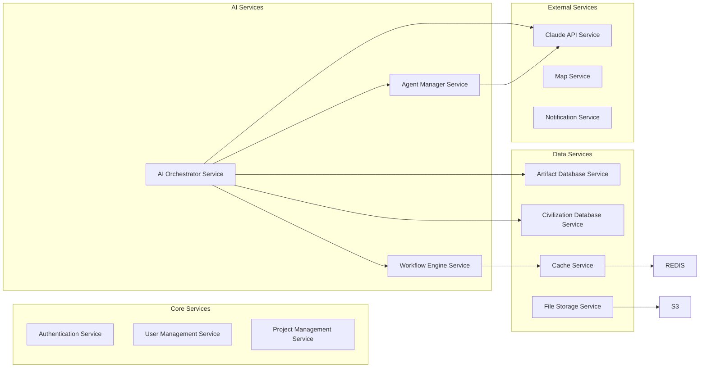

# 🏗️ ArchaeoVault Architecture Guide

## Table of Contents
1. [System Overview](#system-overview)
2. [Sequence Diagrams](#sequence-diagrams)
3. [AI Agent Architecture](#ai-agent-architecture)
4. [Microservices Design](#microservices-design)
5. [Data Architecture](#data-architecture)
6. [API Design](#api-design)
7. [Security Architecture](#security-architecture)
8. [Scalability & Performance](#scalability--performance)
9. [Deployment Architecture](#deployment-architecture)
10. [Monitoring & Observability](#monitoring--observability)
11. [Technology Stack](#technology-stack)

---

## System Overview

### High-Level Architecture

### Core Principles

1. **Agentic AI Architecture**: Multiple specialized AI agents working collaboratively
2. **Event-Driven Design**: Asynchronous processing with event streams
3. **Microservices Pattern**: Loosely coupled, independently deployable services
4. **12-Factor App Compliance**: Cloud-native, stateless, configurable
5. **Progressive Enhancement**: Graceful degradation when services are unavailable

---

## Sequence Diagrams

### Artifact Analysis Workflow

This sequence diagram illustrates the complete flow when a user uploads an artifact for analysis:

### Multi-Agent Excavation Planning Workflow

This sequence diagram shows the collaborative workflow for excavation planning:

### Real-time Research Assistant Workflow

This sequence diagram demonstrates the real-time research assistance flow:

### Error Handling and Recovery Flow

This sequence diagram shows how the system handles errors and implements recovery mechanisms:

---

## AI Agent Architecture

### Agent Design Pattern

Each AI agent follows a consistent pattern with these core components:

- **Base Agent Class**: Common functionality for all agents
- **Specialized Tools**: Agent-specific capabilities and functions
- **Memory System**: Context retention and learning capabilities
- **Processing Pipeline**: Standardized request/response flow
- **Error Handling**: Robust error management and recovery

### Specialized Agents

#### 1. Artifact Analysis Agent
**Purpose**: Comprehensive analysis of archaeological artifacts
**Capabilities**:
- Visual analysis of artifact images
- Material identification and classification
- Cultural context determination
- Dating estimation
- Preservation recommendations
- Confidence scoring

#### 2. Carbon Dating Agent
**Purpose**: Scientific C-14 dating calculations
**Capabilities**:
- Raw age calculations
- Calibration curve application
- Error analysis and confidence intervals
- Method validation
- Comparative dating

#### 3. Civilization Research Agent
**Purpose**: Research and analysis of historical civilizations
**Capabilities**:
- Database queries and searches
- Geographic analysis
- Timeline construction
- Cultural achievement analysis
- Cross-civilization comparisons

#### 4. Excavation Planning Agent
**Purpose**: Site planning and excavation strategy
**Capabilities**:
- Site assessment and planning
- Resource estimation
- Risk analysis
- Timeline development
- Equipment recommendations

#### 5. Report Generation Agent
**Purpose**: Professional report creation
**Capabilities**:
- Multi-format report generation
- Data synthesis and analysis
- Professional formatting
- Citation management
- Quality assurance

#### 6. Research Assistant Agent
**Purpose**: General archaeological research support
**Capabilities**:
- Literature review
- Data analysis
- Hypothesis generation
- Research methodology guidance
- Knowledge synthesis

### Agent Orchestration

The AI Orchestrator manages multi-agent workflows:

- **Workflow Engine**: Defines and executes agent sequences
- **Context Sharing**: Maintains context across agent interactions
- **Result Synthesis**: Combines outputs from multiple agents
- **Error Recovery**: Handles agent failures gracefully
- **Load Balancing**: Distributes work across agent instances

---

## Microservices Design

### Service Boundaries

### Service Communication

#### Event-Driven Architecture
- **Event Bus**: Centralized event distribution
- **Event Types**: Standardized event schemas
- **Subscribers**: Service-specific event handlers
- **Persistence**: Event store for audit and replay

#### API Gateway Pattern
- **Centralized Routing**: Single entry point for all services
- **Authentication**: Centralized auth validation
- **Rate Limiting**: Request throttling and quotas
- **Circuit Breaker**: Fault tolerance and resilience
- **Load Balancing**: Request distribution

---

## Data Architecture

### Database Design

#### PostgreSQL Schema
**Core Tables**:
- Users: User accounts and profiles
- Projects: Research projects and collections
- Artifacts: Archaeological artifacts and metadata
- Civilizations: Historical civilization data
- Excavations: Excavation sites and plans
- Analysis Results: AI analysis outputs

**Vector Storage**:
- Artifact embeddings for similarity search
- Civilization embeddings for cultural analysis
- Text embeddings for semantic search

#### Redis Caching Strategy
**Multi-Level Caching**:
- L1: Local application cache
- L2: Redis distributed cache
- L3: CDN edge cache

**Cache Patterns**:
- Cache-aside for read-heavy data
- Write-through for critical data
- Write-behind for performance optimization

### Data Flow Patterns

#### Event Sourcing
- **Event Store**: Immutable event log
- **Projections**: Materialized views from events
- **Replay**: Rebuild state from event history
- **Audit Trail**: Complete change history

#### CQRS (Command Query Responsibility Segregation)
- **Command Side**: Write operations and business logic
- **Query Side**: Read operations and data presentation
- **Event Bus**: Synchronization between sides

---

## API Design

### RESTful API Structure

**Core Endpoints**:
- `/api/v1/artifacts` - Artifact management
- `/api/v1/civilizations` - Civilization research
- `/api/v1/excavations` - Excavation planning
- `/api/v1/analysis` - AI analysis services
- `/api/v1/reports` - Report generation

**Design Principles**:
- Resource-based URLs
- HTTP status codes
- JSON request/response format
- Pagination and filtering
- Versioning strategy

### GraphQL API

**Schema Design**:
- Type definitions for all entities
- Query operations for data retrieval
- Mutation operations for data modification
- Subscription operations for real-time updates

**Benefits**:
- Single endpoint for all operations
- Client-specified data requirements
- Strong typing and validation
- Real-time subscriptions

---

## Security Architecture

### Authentication & Authorization

#### Multi-Factor Authentication
- Password-based authentication
- Two-factor authentication (2FA)
- Biometric authentication support
- Single sign-on (SSO) integration

#### Role-Based Access Control (RBAC)
- Hierarchical role structure
- Permission-based access control
- Resource-level permissions
- Dynamic permission assignment

### Data Protection

#### Encryption
- **At Rest**: Database and file encryption
- **In Transit**: TLS/SSL for all communications
- **End-to-End**: Client-side encryption for sensitive data
- **Key Management**: Secure key storage and rotation

#### Input Validation
- **Schema Validation**: JSON schema validation
- **Sanitization**: Input cleaning and normalization
- **Rate Limiting**: Request throttling
- **SQL Injection Prevention**: Parameterized queries

### API Security

#### Security Headers
- Content Security Policy (CSP)
- X-Frame-Options
- X-Content-Type-Options
- Strict-Transport-Security

#### Monitoring
- Security event logging
- Anomaly detection
- Intrusion detection
- Automated threat response

---

## Scalability & Performance

### Horizontal Scaling Strategy

#### Auto-Scaling
- **CPU-based**: Scale based on CPU utilization
- **Memory-based**: Scale based on memory usage
- **Queue-based**: Scale based on queue length
- **Custom metrics**: Scale based on business metrics

#### Load Balancing
- **Round Robin**: Simple request distribution
- **Weighted Round Robin**: Capacity-aware distribution
- **Least Connections**: Connection-based distribution
- **Health Checks**: Automatic unhealthy instance removal

### Performance Optimization

#### Database Optimization
- **Indexing Strategy**: Optimized database indexes
- **Query Optimization**: Slow query identification and optimization
- **Connection Pooling**: Efficient database connections
- **Read Replicas**: Read workload distribution

#### Caching Strategy
- **Application Cache**: In-memory caching
- **Distributed Cache**: Redis-based caching
- **CDN**: Edge caching for static content
- **Cache Invalidation**: Intelligent cache management

---

## Deployment Architecture

### Container Orchestration

#### Docker Containers
- **Multi-stage Builds**: Optimized container images
- **Health Checks**: Container health monitoring
- **Resource Limits**: CPU and memory constraints
- **Security Scanning**: Container vulnerability scanning

#### Kubernetes Deployment
- **Pods**: Container orchestration
- **Services**: Network service abstraction
- **Ingress**: External traffic routing
- **ConfigMaps/Secrets**: Configuration management

### Infrastructure as Code

#### Terraform
- **Infrastructure Definition**: Declarative infrastructure
- **State Management**: Infrastructure state tracking
- **Modular Design**: Reusable infrastructure components
- **Environment Management**: Multi-environment support

#### Helm Charts
- **Application Packaging**: Kubernetes application packages
- **Version Management**: Application version control
- **Dependency Management**: Service dependency resolution
- **Configuration Management**: Environment-specific configuration

---

## Monitoring & Observability

### Metrics Collection

#### Application Metrics
- **Business Metrics**: User activity, artifact analysis counts
- **Technical Metrics**: Response times, error rates, throughput
- **Resource Metrics**: CPU, memory, disk usage
- **Custom Metrics**: Domain-specific measurements

#### Infrastructure Metrics
- **System Metrics**: Server performance indicators
- **Network Metrics**: Network performance and connectivity
- **Database Metrics**: Database performance and health
- **External Service Metrics**: Third-party service health

### Distributed Tracing

#### Request Tracing
- **Trace Context**: Request flow across services
- **Span Management**: Individual operation tracking
- **Dependency Mapping**: Service dependency visualization
- **Performance Analysis**: Bottleneck identification

### Logging Strategy

#### Structured Logging
- **JSON Format**: Machine-readable log format
- **Correlation IDs**: Request tracing across services
- **Log Levels**: Appropriate log level usage
- **Context Enrichment**: Additional context in logs

#### Centralized Logging
- **Log Aggregation**: Centralized log collection
- **Log Analysis**: Pattern recognition and alerting
- **Retention Policies**: Log retention and archival
- **Search and Discovery**: Log search capabilities

---

## Technology Stack

### Core Technologies

| Category | Technology | Purpose | Version |
|----------|------------|---------|---------|
| **Frontend** | Streamlit | Web UI Framework | 1.28+ |
| **Backend** | Python | Core Language | 3.8+ |
| **AI/ML** | Anthropic Claude | AI Analysis | Sonnet 4.5 |
| **Database** | PostgreSQL | Primary Database | 15+ |
| **Cache** | Redis | Caching Layer | 7+ |
| **Storage** | AWS S3 | Object Storage | - |
| **Search** | PostgreSQL + pgvector | Vector Search | - |
| **Monitoring** | Prometheus + Grafana | Metrics & Monitoring | - |
| **Logging** | ELK Stack | Centralized Logging | - |
| **Tracing** | Jaeger | Distributed Tracing | - |

### AI/ML Stack

#### Core AI Technologies
- **Anthropic Claude**: Primary AI language model
- **Text Embeddings**: Semantic search and similarity
- **Vector Database**: High-dimensional data storage
- **Image Processing**: Computer vision capabilities

#### AI Infrastructure
- **Model Serving**: AI model deployment and serving
- **Batch Processing**: Large-scale data processing
- **Real-time Inference**: Low-latency AI responses
- **Model Versioning**: AI model lifecycle management

### Development Tools

#### Code Quality
- **Black**: Code formatting
- **isort**: Import sorting
- **flake8**: Linting
- **mypy**: Type checking
- **pre-commit**: Git hooks

#### Testing
- **pytest**: Testing framework
- **pytest-asyncio**: Async testing
- **pytest-cov**: Coverage
- **factory-boy**: Test data
- **httpx**: API testing

#### Documentation
- **Sphinx**: Documentation generation
- **mkdocs**: Markdown documentation
- **Swagger**: API documentation
- **Mermaid**: Architecture diagrams

#### Deployment
- **Docker**: Containerization
- **docker-compose**: Local development
- **Kubernetes**: Container orchestration
- **Helm**: Package management
- **Terraform**: Infrastructure as code

---

## Conclusion

This architecture provides a robust, scalable foundation for the ArchaeoVault application. The agentic AI design allows for specialized, intelligent processing while maintaining system reliability and performance. The microservices approach ensures independent scaling and deployment, while the comprehensive monitoring and observability stack provides full visibility into system behavior.

The architecture is designed to grow with the application's needs, supporting everything from small research projects to large-scale archaeological databases with thousands of users and millions of artifacts.

---

*This architecture document is a living document and should be updated as the system evolves and new requirements emerge.*